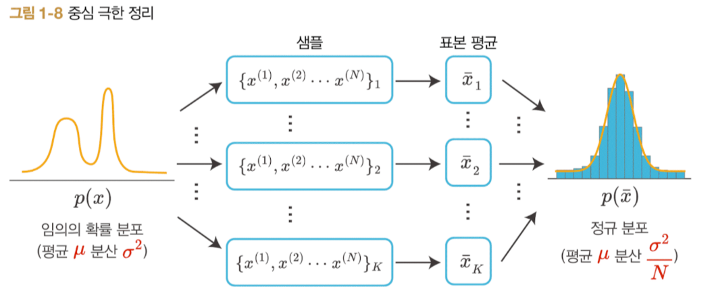
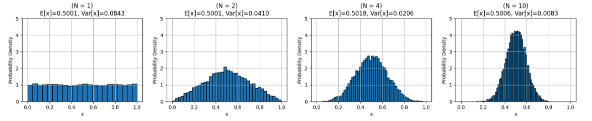

# Probability Distribution(확률 분포)

확률 변수가 어떤 값을 가질지에 대한 확률을 나타낸다.

다시 말해, 확률 변수가 가질 수 있는 값들과 그 값에 대응하는  확률을 나타낸 것이다.

크게 이산 확률 분포와 연속 확률 분포로 나뉜다.

이산 확률 분포는 확률 질량 함수(Probability Mass Function, PMF)로,

연속 확률 분포는 확률 밀도 함수(Probability Density Function, PDF)로 나타낸다.

## 확률 질량 함수(PMF)와 확률 밀도 함수(PDF)

**Probaility Mass Function(확률 질량 함수)** 는 이산 확률 분포를 나타내는 함수이다.

대표적으로 베르누이 분포, 이항 분포 등이 있다.

확률 질량 함수($P(X=x)$)의 경우, 다음 조건을 만족해야 한다.

- 각 값의 확률은 0과 1 사이이다. $0 \le P(X=x) \le 1$

- 확률 질량 함수 넓이의 합은 1이다. $\sum P(X=x) = 1$

- 어떤 구간[a, b]이 가지는 확률은 [a, b]의 확률을 모두 더한 것과 같다. $P(a \le X \le b) = \sum ^b_{k=a} P(X=k)$

**Probability Density Function(확률 밀도 함수)** 는 연속 확률 분포를 나타내는 함수이다.

대표적으로 가우시안 분포, 라플라스 분포 등이 있다.

확률 '밀도' 함수는 개별 값들에 대한 확률값이 존재하지 않는다.

연속의 경우, 반드시 구간 단위로 확률이 존재할 수 밖에 없기 때문이다.

확률 밀도 함수($f(x)$)의 경우, 다음 조건을 만족해야 한다.

- 어떤 값에 대한 확률값 자체를 나타내는 PMF와 다르게, PDF는 확률 밀도를 나타내므로, 0 이상이어야 하고 1보다 클 수 있다. $f(x) \ge 0$ 

- 확률 밀도 함수 넓이의 합은 1이다. $\int f(x) = 1$

- 어떤 구간[a. b]이 가지는 확률은 [a, b]에서의 넓이와 같다. $P(a \le x \le b) = \int_a^b f(x)$

---
# Central Limit Theorem(중심 극한 정리, CLT)

중심극한정리는 아래와 같다.

모집단이 {평균이 $\mu$이고 표준편차가 $\sigma$인 임의의 분포}를 따른다고 할 때, 이 모집단으로부터 추출된 표본의 {표본의 크기 n이 충분히 크다}면 표본 평균들이 이루는 분포는 {평균이 $\mu$이고 표준편차가 $\sigma/\sqrt n$인 정규분포}에 근접한다.

모집단이 어떤 형태의 분포를 따르는지에 상관없이 모집단에서 샘플링된 표본 집단들의 평균은 정규 분포를 따른다는 것이다.

예를 들어 정육면체 주사위에서 1부터 6까지 숫자가 발생할 확률은 1/6로 균등 분포(Uniform Distribution)을 따른다.

이 때 주사위 N번을 던진 후 결과를 관측한 첫번째 표본 집단을 $S_1$이라 하자.

같은 시행을 K번 반복한 표본 집단의 집합을 $S = \{S_1, S_2, \cdots, S_K\}$라 할때, 이 표본 집단들의 평균 $\mu_S = \{ \mu_{S_1}, \mu_{S_2}, \cdots, \mu_{S_K} \}$은 정규 분포의 형태를 가진다는 것이다.

---

# Bernoulli Distribution(베르누이 분포)

이진 확률 분포의 일종으로, 두가지 가능한 결과 중 하나가 발생할 확률을 모델링함

두 가지 경우밖에 없기때문에 이산 확률 분포이므로, PMF(Probability Mass Function, 확률 질량 함수)로 정의할 수 있다.

$P(X=x) = p^x(1-p)^{1-x}, \quad x \in {0, 1}$

위 식이 의미하는 것은 $x$가 1인 경우의 확률은 $p$, 0인 경우의 확률은 $1-p$라는 것이다.

베르누이 분포의 기대값은 $x=1$일 때 이므로

$\mathbb E[X] = 0 \cdot (1-p) + 1 \cdot p = p$ 이고

분산은 다음과 같이 계산된다.

$Var(x) = \mathbb E[X^2] - (\mathbb E[X])^2 = p - p^2 = p(1-p)$

---

# Laplace Distribution(라플라스 분포)

$$f(x) = \frac{1}{2b} \exp [\frac{-|x-\mu|}{b}]$$

- 라플라스 분포는 위와 같은 확률 밀도 함수로 표현된다.

- 가우시안 분포와 유사하지만 뾰족한 모양의 확률 밀도 함수이다.

- 범위는 $-\infty < x < \infty$ 으로 모든 실수 범위이다.

- 평균 : $\mu$, 분산 : $2b^2$, 표준편차 : $\sqrt2 b$, 이 때 $b$는 스케일 상수라고도 함 

- 라플라스 분포는 확률 밀도 함수이기 때문에 적분했을 때 1이 된다. 절대값을 포함하기 때문에, 구간을 나누어서 적분해야한다.

&nbsp;

  
- $x \ge 0$ 의 경우

$$\int^\infty_0 \frac{1}{2b}\exp (\frac{x}{b})dx = \frac{1}{2b}\int^\infty_0\exp(-\frac{x}{b})dx = \frac{1}{2b}[-b \exp (-\frac{x}{b})]^\infty_0 = \frac{1}{2}$$

- $x < 0$ 의 경우

$$\int^0_{-\infty} \frac{1}{2b}\exp (\frac{x}{b})dx = \frac{1}{2b}\int^0_{-\infty}\exp(-\frac{x}{b})dx = \frac{1}{2b}[b \exp (-\frac{x}{b})]^0_{-\infty} = \frac{1}{2}$$

- 두 구간에 대한 적분을 합치면 합이 1이 된다.
---

# IID(Independent and Identically Distributed) 확률 변수

IID란 직역하면 **'독립 항등 분포를 따르는'** 이다.

어떤 분포를 특정하는 말이 아니라 표본 집단의 특성을 의미하는 말이다.

확률 변수가 IID이려면 두 가지 조건을 만족해야 한다.

예를 들어 모집단($X$)에서 표본 집단($x$)가 추출되었다고 하자.

- Independent(독립) : 표본 집단의 원소($x_1, x_2, x_3, \dots, x_n$)들은 서로 독립이어야 한다.

- Identically(동일, 항등) : 표본 집단($x$)에 속한 원소($x_1, x_2, x_3, \dots, x_n$)들은 모두 같은 모집단($X$)에서 셈플링되어야 한다.

위 두 조건을 만족하는 경우 표본 집단 $x$가 IID하다고 말할 수 있다.

주사위를 세 번 던지는 상황을 가정해보자.

각각 1, 3, 5가 나왔다. 이 때, 첫번째 시행에서 1이 나왔다고해서, 두번째 시행에 영향을 미치지 않는다. 따라서 각 시행은 서로 영향을 주지 않고 Independent(독립적)이라고 할 수 있다.

또한 1, 3, 5는 모두 동일한 모집단(주사위)에서 관측되었기 때문에 Identically(항등)이다.

따라서 IID인 것이다.

그렇다면 Independet를 만족하지 않는 경우는? 날씨로 생각해볼 수 있다.

오늘 날씨가 내일 날씨에 영향을 미치기 때문이다.

또한 Identically를 만족하지 않는 경우는 표본 집단에서 일부는 가우시안 분포, 일부는 포아송 분포를 따르는 경우이다.

일반적으로 머신러닝에서는 대게의 경우, 모든 샘플들이 IID라고 가정한다.